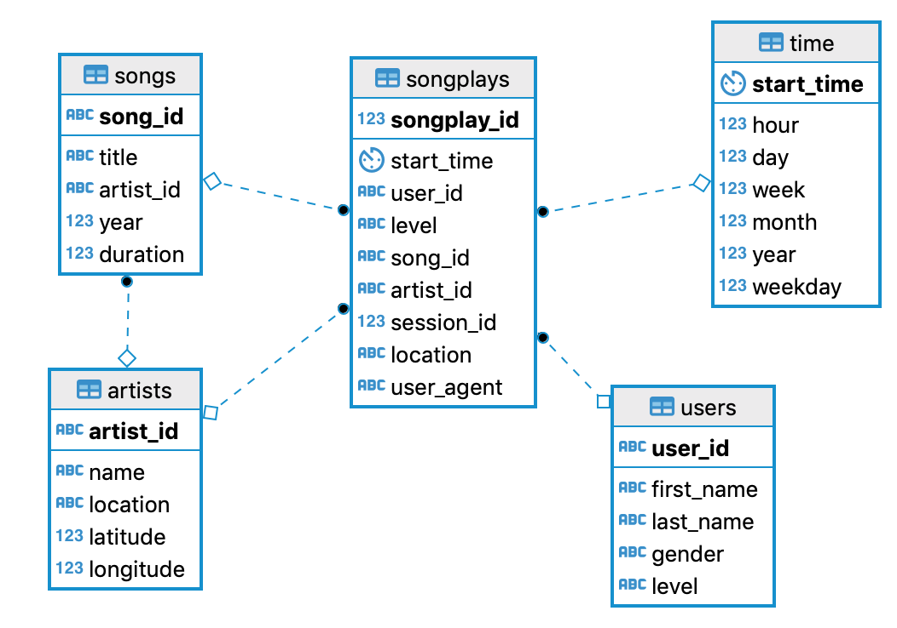

# Data Modeling with Posgres
## Summary of project
A startup called Sparkify wants to analyze the data they've been collecting on songs and user activity on their new music streaming app. The analytics team is particularly interested in understanding what songs users are listening to. Currently, they don't have an easy way to query their data, which resides in a directory of JSON logs on user activity on the app, as well as a directory with JSON metadata on the songs in their app.
This project aims to build a Postgres database model with current song library and the users' log.

## How to run the python scripts
1. Download and install **Postgres** on your machine by following official document with your respective OS system. There are three versions of postgres you can install including: Interactive installer by EnterproseDB, Graphical installer by BigSQL or Postgres.app. If you are a command line coder, go with Postgres.app; else the graphical installer is easier to begin with. Download and instruction here: [Postgres Download](https://www.postgresql.org/download)

2. Setup account (user: *student*, psw: *student*) for this project. It is straight forward with the friendly UI as below screenshot.

    

3. Run `python create_tables.py` to drop all existing tables required for this project, then create them again with blank data.

4. Run `python etl.py` to load data from song data and log data into created tables in step 3.

5. Open **test.ipynb** by jupyter notebook to test if the tables are created and data are loaded properly. It cannot run if you havent install ipython-sql because the script uses *jupyter magic with sql*. Explore more here: [Jupyter magic with sql](https://towardsdatascience.com/jupyter-magics-with-sql-921370099589)

## Files in the repository
In addition to the data files, the project workspace includes five files:
1. `test.ipynb` displays the first few rows of each table to let you check your database.
2. `create_tables.py` drops and creates your tables. You run this file to reset your tables before each time you run your ETL scripts.
3. `etl.ipynb` reads and processes a single file from song_data and log_data and loads the data into your tables. This notebook contains detailed instructions on the ETL process for each of the tables.
4. `etl.py` reads and processes files from song_data and log_data and loads them into your tables. You can fill this out based on your work in the ETL notebook.
5. `sql_queries.py` contains all your sql queries, and is imported into the last three files above.

## Dataset used
 The first dataset is a subset of real data from the Million Song Dataset. Each file is in JSON format and contains metadata about a song and the artist of that song. The files are partitioned by the first three letters of each song's track ID. For example, here are filepaths to two files in this dataset.
> song_data/A/B/C/TRABCEI128F424C983.json  
 song_data/A/A/B/TRAABJL12903CDCF1A.json

The second dataset consists of log files in JSON format generated by this [event simulator](https://github.com/Interana/eventsim) based on the songs in the dataset above. These simulate app activity logs from a music streaming app based on specified configurations.
> log_data/2018/11/2018-11-12-events.json  
log_data/2018/11/2018-11-13-events.json

## The database schema design
This is our target entity relational diagram to achieve.

    

